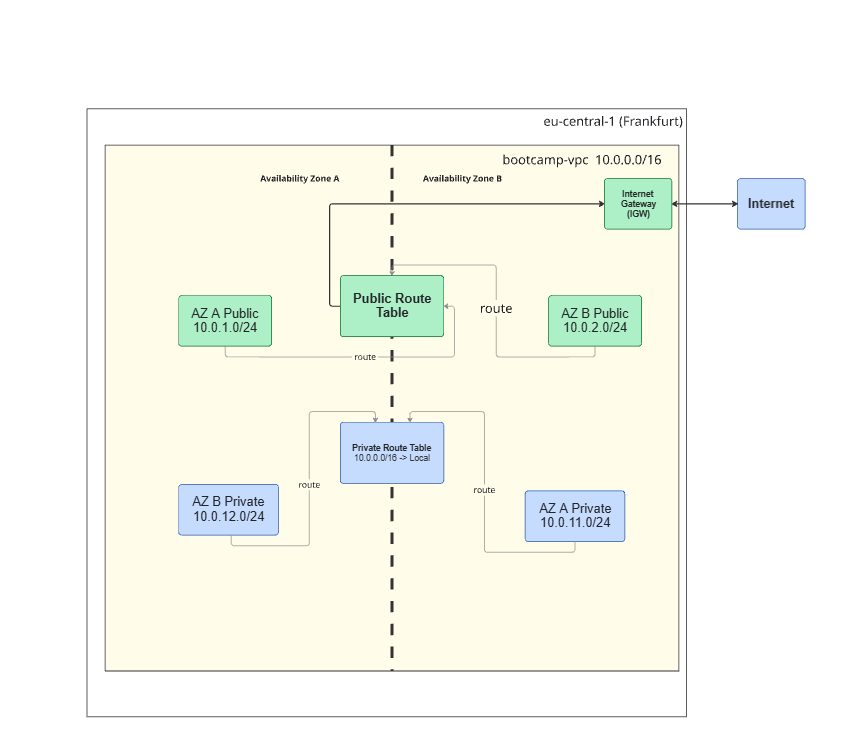

# ce-lab-vpc-networking

This project demonstrates the creation of a production-ready AWS VPC environment. It features a tiered network architecture across multiple Availability Zones (Multi-AZ) to ensure high availability and security through proper subnet segmentation.

---

## 📁 Repository Structure

*   **README.md**: Project overview, architectural documentation, and reflection questions.
*   **architecture-diagram.png**: A visual representation of the VPC, subnets, route tables, and internet connectivity.
*   **network-config/**:
    *   **vpc-config.txt**: Technical details of the VPC (ID, CIDR, and DNS settings).
    *   **subnet-config.txt**: Configuration data for all 4 subnets (IDs, AZs, and IP ranges).
    *   **route-tables.txt**: Detailed route entries and associations for public and private traffic.
*   **screenshots/**: 
    *   Contains AWS Console verification images (VPC dashboard, subnet list, IGW attachment, route tables, and Resource Map).
*   **validation/**:
    *   **connectivity-test.md**: Documentation of the logic used to verify network isolation and internet access.

---

## 🏗️ Architecture Overview

The design consists of one VPC (`10.0.0.0/16`) split into:
- **Public Tier**: Two subnets with routes to an **Internet Gateway (IGW)** for web-facing resources.
- **Private Tier**: Two subnets with no external routes, reserved for backend resources like databases.

---

## 🧠 Reflection Questions

**1. Why use 10.0.0.0/16 instead of 10.0.0.0/24?**
A `/16` block provides 65,536 IP addresses, allowing for significant future growth and the ability to create many more subnets. A `/24` block only provides 251 usable IPs, which is easily exhausted in production.

**2. What is the difference between public and private subnets?**
The difference lies in the **Route Table**. A public subnet has a route to an **Internet Gateway (0.0.0.0/0)**, whereas a private subnet only has a **local route**, keeping it isolated from the public internet.

**3. Why deploy across multiple Availability Zones?**
To achieve **High Availability (HA)**. If one physical data center (AZ) experiences a failure, the resources in the other AZ will continue to function, preventing a total service outage.

**4. How many usable IP addresses are in 10.0.1.0/24?**
There are **251 usable IPs**. While a `/24` has 256 addresses, AWS reserves 5 for internal networking purposes (Network address, VPC router, DNS, future use, and Broadcast address).

---

## ✅ Validation Results
- **Static Route Audit**: Confirmed `public-rt` points to IGW and `private-rt` remains local-only.
- **Resource Map**: AWS Resource Map confirms all subnets are associated with the correct route tables.
- **Auto-assign IP**: Enabled for public subnets to ensure EC2 instances receive public DNS names.